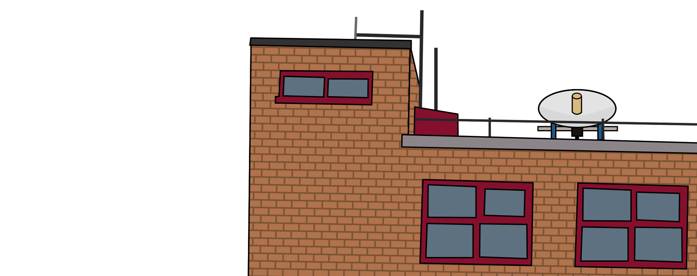
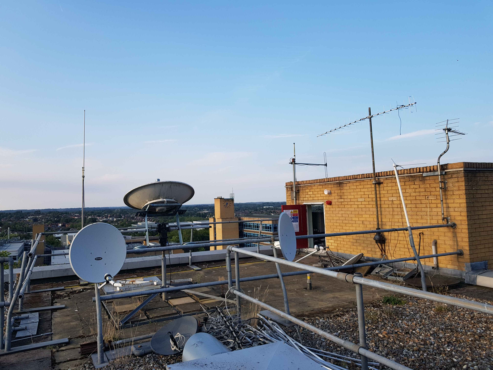



<h1><b>Tillingbourne</b></h1>

**Tillingbourne** is our student-run satellite ground station, based on top of the residential accomodation building of the same name, maintained continiously by Caspar Pierce (**M0KRH**) since 2022.

This area was our first radio shack, dating back to 1958, when the club callsigns were first issued (**G8AHK**/**G3IGQ**).

The area seemed to be reaquired in the mid 2010s, when a large parabolic dish (from the Surrey Space Centre) was acquired and installed, to be used on the roof.

For unknown reasons (most likely to keep the dish safe) over COVID, the hardware was dismantled and the parabolic dish settled on one of the railings along with the counterweights, and the Society went dormant/hidden for the next few years.

During 2022, Caspar, the Radio Officer at the time, managed to make contact to Neil Jones (**M0SNJ**), a previous radio officer about the history of the society, and it was only after a coffee break that any mention on Tilly was made after all the years.

The entrance to the ground station seems underwhelming and confusing at first, as entry to the area is made through a loft hatch.

*Tillingbourne in September 2024*

The place has many plans for the future, and is used as a tool to teach students about satellite communications and space activities.

The repeater [GB3TY](GB3TY) is also situated here.